#Hasura as an example of No / Low Code for Backend

## Overview
Web development started of with Monolithic version of three tier architecture (backend database, app server, and frontend) and app-server containers like Weblogic, JBoss, IBM Websphere in the Java world helped integrate many different services, but still a monolithic and takes long time to develop and deploy applications and hard to test. Dependency Injection Framework like Spring transformed the speed of development and evolved with micro services architecture. With modern AI world, the services to expose the data from database as web api based on business logic takes some time to even with evolution of IDEs integrating with AI assistants like co-pilot. Hasura address this issue with very little code do the heavy lifting.

## Problem with API development using webservices

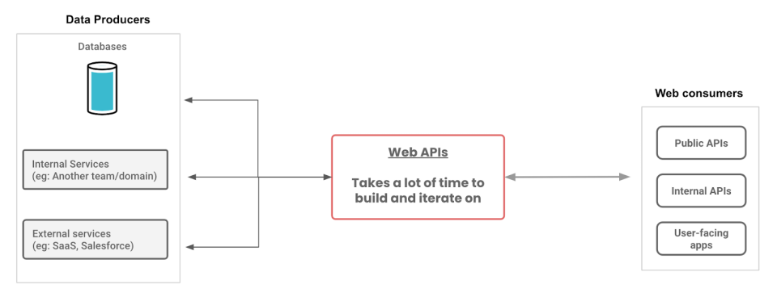

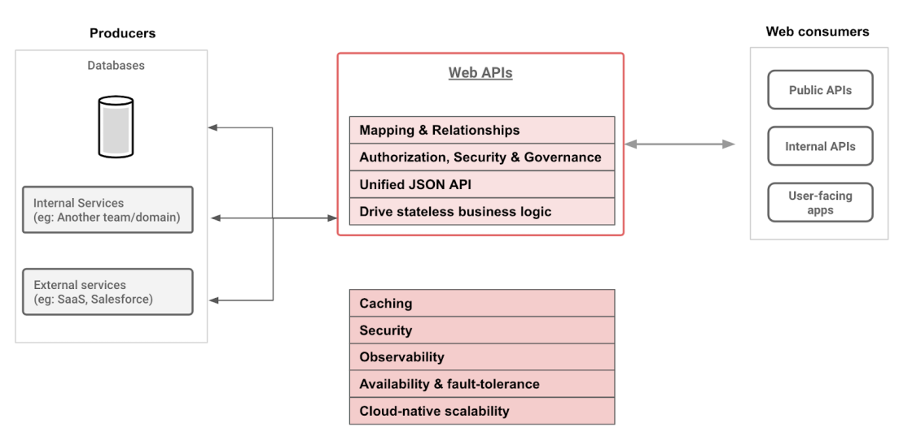

The time it takes to develop the Web APIs by creating the models in a language and write unit tests and deploy it to different environments along with maintaining the services is lot of time.

## Hasura doing Heavy Lifting

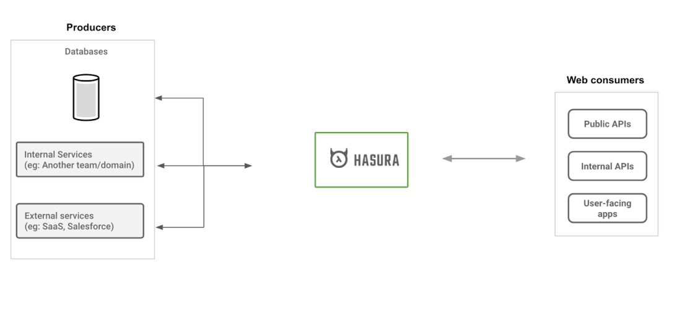
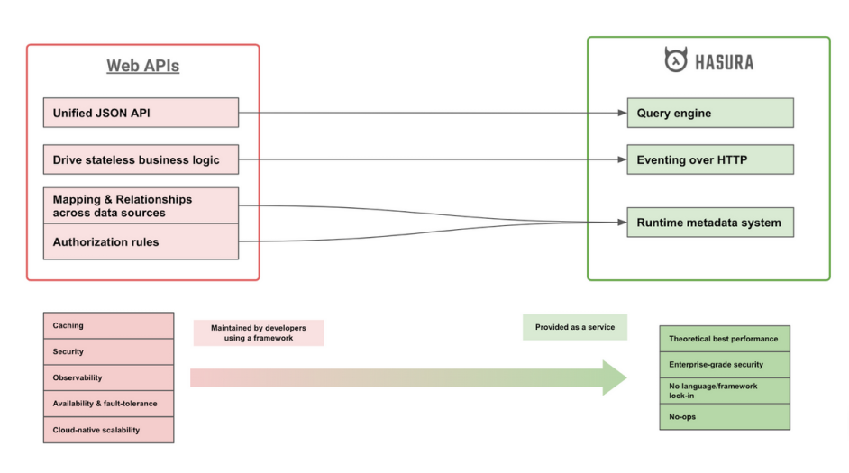
Hasura exposes the underlying data from database as GraphQL apis, has the metadata of the database tables to expose the data mappings, relationships of the data model.

## Hasura Components from Docker Installation

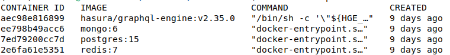

The minimum set of components needed are the Hasura graphql engine, Postgres database to store the metadata (table definitions), redis for caching

### Hasura Data editor Web UI

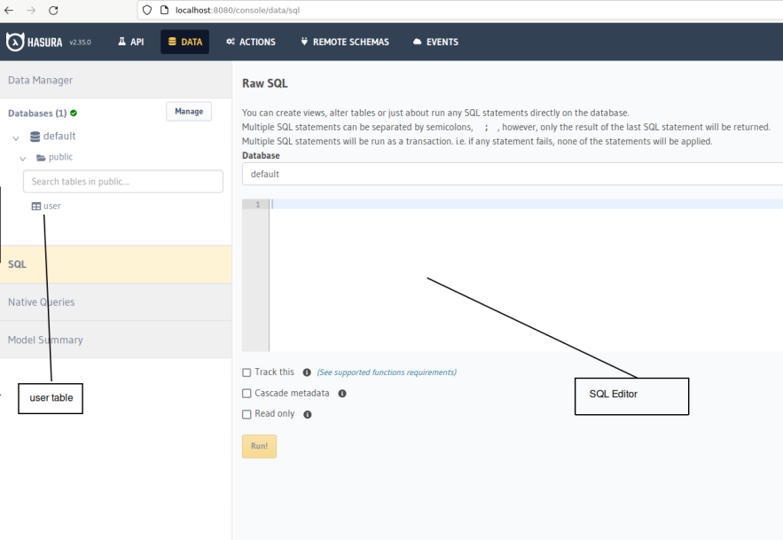

The above picture is the SQL Web Editor of Hasura, the instance is created with a table user in public schema of postgres. You can execute the SQL statements with SQL editor or using the GUI to create the table structures manually. There is also APIs to automatically create the metadata.

Below is the table structure of user table

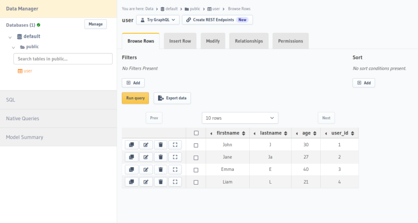

### GraphQL UI
Once the table Structure is created and tracked by Hasura in their metadata, this can be accessed in GraphQL UI to retrieve data from the database.

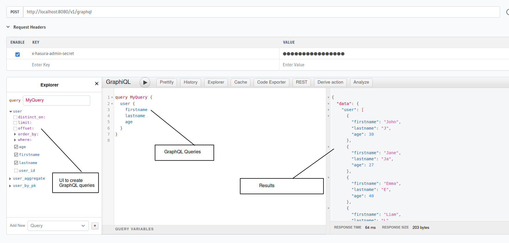

The graphQL queries can be executed as rest endpoint to retrieve the data and can control which fields can be accessed, add where clause conditions and order the results.

### Filtering the data

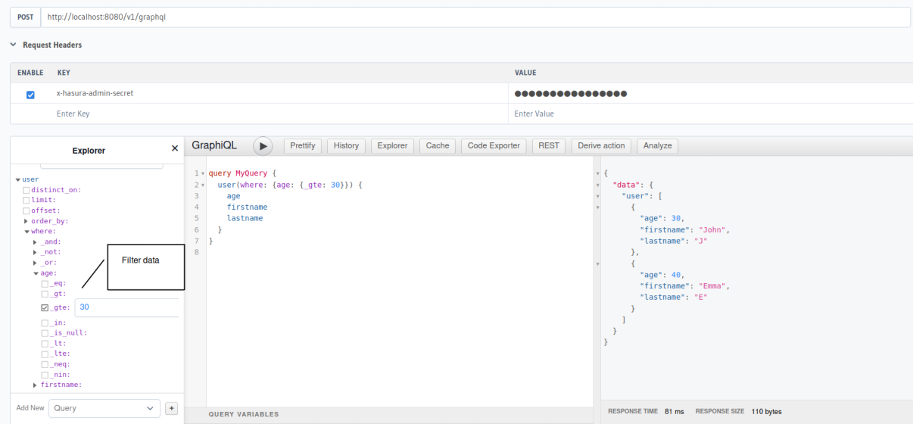

### Browsing the Table data,

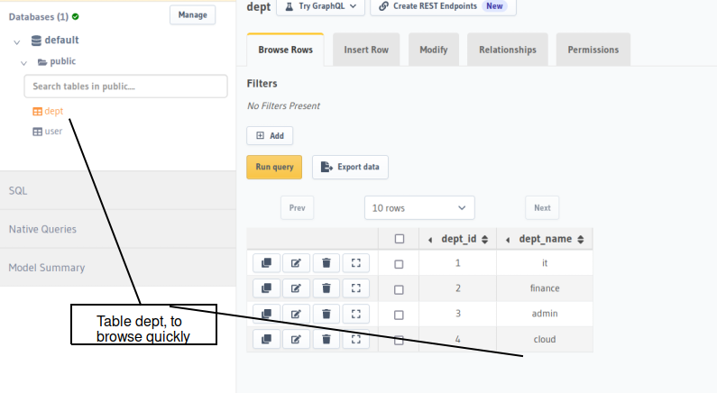

### Joining with two tables

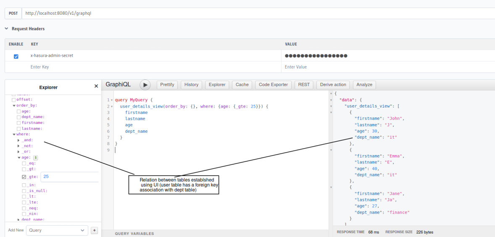

### Query using Postman
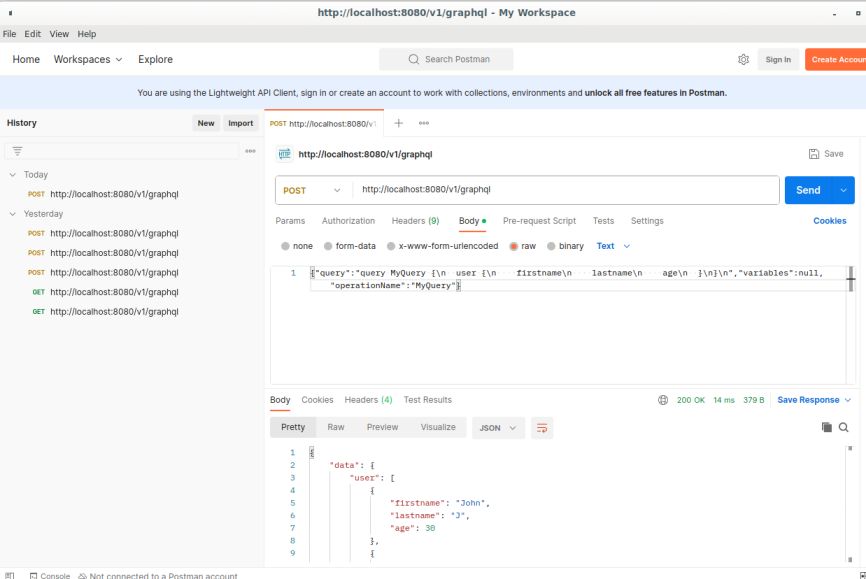

## Mutations
Hasura Insertions could be done in a similar way to query the data, reference on how to use it is below,

[Hasura Mutations](https://hasura.io/learn/graphql/intro-graphql/graphql-mutations/)

## Business Validations / Integrating external services
'''
* Standard input validations could be done through UI
* Complex data join could be done using views / mviews
* To integrate and validate business rules with external services, need to use Hasura actions [Hasura Actions](https://hasura.io/learn/graphql/hasura/custom-business-logic/)
